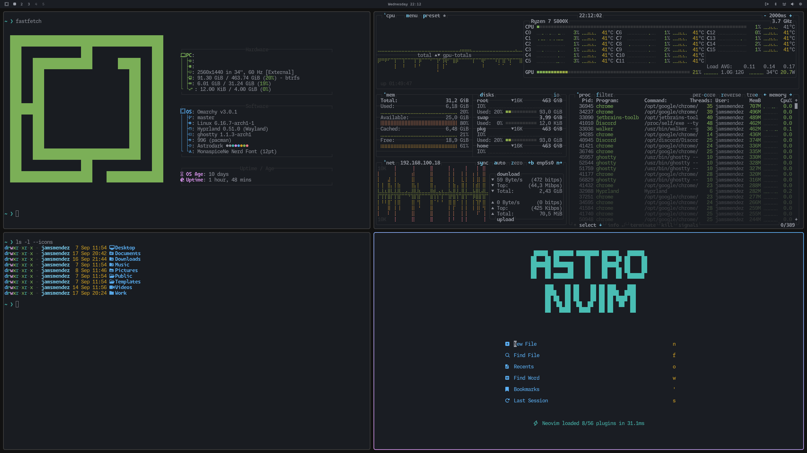

# Astrodark Theme

Astrodark theme for Omarchy based on [Astronvim](https://astronvim.com) themes



## Requirements

Omarchy 4 or later. For Omarchy 3.x, use the `v3.8.5-legacy` tag:

```bash
git checkout v3.8.5-legacy
```

## Install

```bash
omarchy theme install https://github.com/JamsMendez/omarchy-astrodark-theme
```

## Notes

Omarchy 4 generates `btop.theme`, `alacritty.toml`, `ghostty.conf`, `hyprland.lua`,
`keyboard.rgb`, `chromium.theme`, and the shell surface colors from `colors.toml`
using the templates in `/usr/share/omarchy/default/themed/`. Only the source
colors and the app-specific selections live here.

## Herdr

Omarchy does not theme [herdr](https://herdr.dev) on its own — it seeds a static
config that rides on the terminal's ANSI palette, so herdr's sidebar, panels and
agent status colors never follow the active theme.

The `omarchy/` directory adds that integration:

| File | Role |
| --- | --- |
| `omarchy/themed/herdr.toml.tpl` | Maps `colors.toml` onto herdr's color tokens |
| `omarchy/hooks/theme-set.d/sync-herdr` | Merges the rendered colors into the live herdr config |

Install once:

```bash
mkdir -p ~/.config/omarchy/themed ~/.config/omarchy/hooks/theme-set.d
cp omarchy/themed/herdr.toml.tpl ~/.config/omarchy/themed/
cp omarchy/hooks/theme-set.d/sync-herdr ~/.config/omarchy/hooks/theme-set.d/
chmod +x ~/.config/omarchy/hooks/theme-set.d/sync-herdr
```

Then switch themes (`omarchy-theme-set astrodark`) to apply. It works for every
Omarchy theme with a `colors.toml`, not just this one.

The hook rewrites only the block between its `# >>> omarchy theme colors`
markers, so keybindings and other herdr settings are preserved. It also comments
out the seeded `[ui] accent = "blue"`, which would otherwise override the themed
accent. A running herdr server is retinted via `herdr server reload-config`; no
restart is needed.
